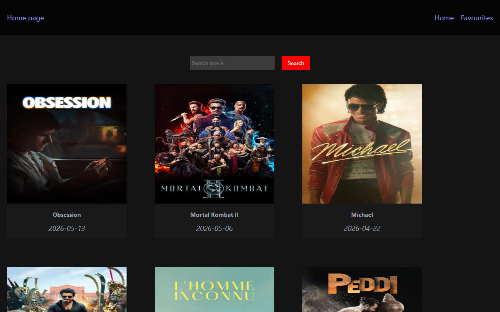
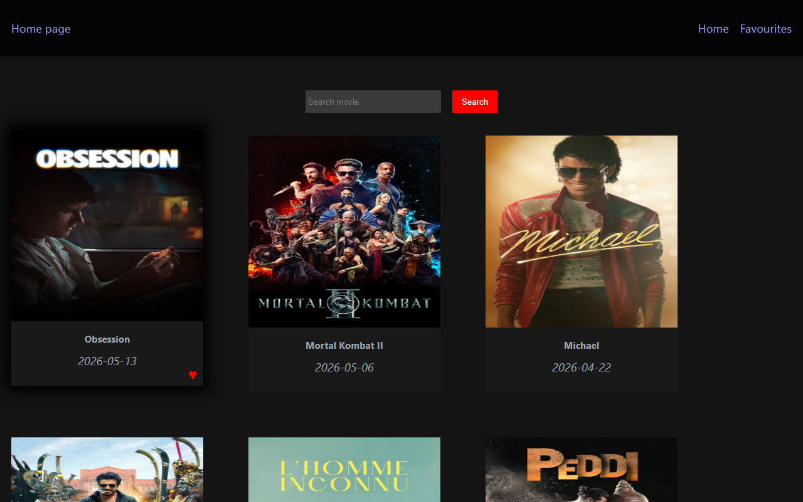
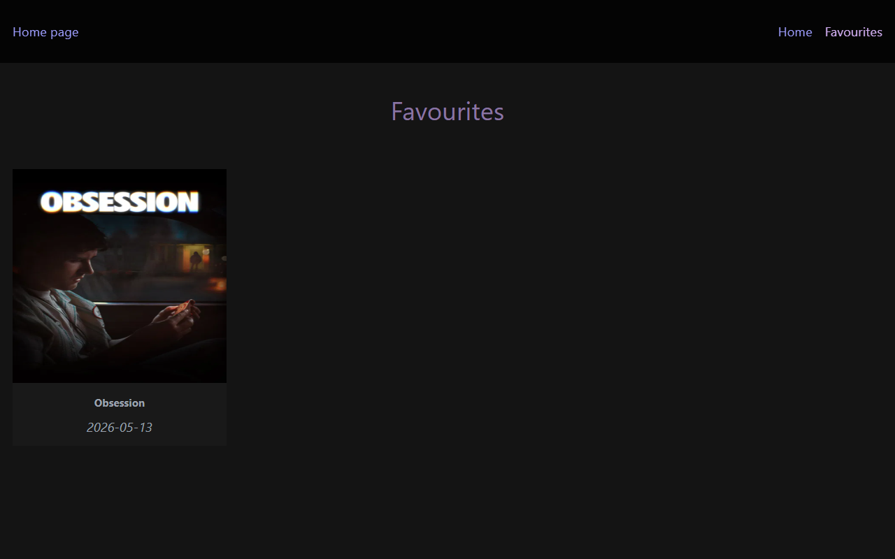

# 🎬 Movie Search Engine

A modern, responsive movie search web application built with **React**, **React Router**, and the **TMDB (The Movie Database) API**. It allows users to browse popular trending movies, search for specific titles in real-time, and save their favorite movies to a personalized page powered by **HTML5 LocalStorage**.

---

## ✨ Features

- **Trending Movies**: Automatically fetches and displays popular movies on load.
- **Real-time Movie Search**: Allows users to search for any movie in the TMDB database.
- **Favorites System**: Add/remove movies from favorites with a single click (using LocalStorage for persistence).
- **Responsive Layout**: Clean grid styling that adapts perfectly to desktop, tablet, and mobile displays.
- **State Management**: Uses React Context API for global favorite state distribution.
- **Error & Loading Handling**: Graceful loading indicators and user-friendly error messages.

---

## 🛠️ Tech Stack

- **Framework**: React 19
- **Routing**: React Router DOM v7
- **State Management**: React Context API
- **Styling**: Vanilla CSS3 (with backdrop-blur/glassmorphic navbar, hover animations, and smooth transitions)
- **API**: TMDB API (The Movie Database)
- **Bundler**: Vite

---

## 📂 Project Structure

```bash
movie-search-engine/
│
├── App.jsx                   # Main Application shell & route configuration
├── index.html                # HTML entry template
├── package.json              # Project metadata & dependency list
├── vite.config.js            # Vite configuration
├── eslint.config.js          # ESLint rules configuration
│
├── screenshots/              # Application screenshots
│   ├── home.png              # Home page screenshot
│   ├── home_favorited.png    # Home page with a favorited movie card
│   └── favorites.png         # Favorites page screenshot
│
└── src/
    ├── main.jsx              # React mounting entry point
    ├── index.css             # Global CSS styling & design tokens
    │
    ├── context/
    │   └── context.jsx       # Movie Provider & Context for Favorite state
    │
    └── assets/
        ├── api/
        │   └── api.js        # TMDB API communication layer
        │
        ├── components/
        │   ├── movie-card.jsx# Reusable card component for each movie
        │   └── navbar.jsx    # Glassmorphic top navigation bar
        │
        ├── css/
        │   ├── fav.css       # Favorite page specific styles
        │   ├── home.css      # Home page specific styles
        │   ├── moviecard.css # Movie card layout & hover styles
        │   └── navbar.css    # Navbar layout & scrollbar styles
        │
        └── pages/
            ├── favorite.jsx  # Favorites display page
            └── home.jsx      # Home/Search display page
```

---

## 🚀 Getting Started

### 1. Clone the Repository
```bash
git clone https://github.com/your-username/movie-search-engine.git
cd movie-search-engine
```

### 2. Install Dependencies
```bash
npm install
```

### 3. API Key Setup
Currently, the application comes with a pre-configured TMDB API key in [api.js](file:///c:/Users/aayus/OneDrive/Pictures/Screenshots%201/Collage/Job/Projects/movie-search-engine/src/assets/api/api.js):
```javascript
const apikey = "e43a47f72dcdb43e634c6da9bedf76ea";
```
*Note: For production environments, it is recommended to store your API key securely in a `.env` file as `VITE_TMDB_API_KEY` and access it via `import.meta.env.VITE_TMDB_API_KEY`.*

### 4. Run Development Server
```bash
npm run dev
```
Open `http://localhost:5173/` in your browser to view the application.

---

## 📸 Screenshots

<<<<<<< HEAD
### Home Page (Trending Movies)
Displays popular movies on load. Users can hover over any movie card to reveal the favorite (♥) button.


### Favoriting a Movie
Clicking the favorite button highlights the heart icon in red and saves the movie to local storage.


### Favorites Page
Displays all saved movies. If no movies are favorited, a friendly placeholder card is shown.


---

## 📈 Future Enhancements

- **Debounced Search**: Reduce API calls by triggering search only after the user stops typing.
- **Infinite Scroll / Pagination**: Load more movies dynamically as the user scrolls.
- **Detailed View**: Create a dedicated details page for each movie with ratings, genres, cast, and trailers.
- **Dark/Light Mode Toggle**: Allow users to toggle theme preferences.
- **Skeleton Loaders**: Replace the basic "loading" text with modern animated skeleton shapes.

---

## 👤 Author
=======
Create a `.env` file in the root directory.

```env
VITE_TMDB_API_KEY=your_api_key_here
```

Get your API key from:

:contentReference[oaicite:0]{index=0}

---

# API Used

This project uses the TMDB API for fetching movie data.

Endpoints used:

```bash
/movie/popular
/search/movie
```

---

# Screenshots

*

```

---

# What I Learned
>>>>>>> 62da03972c077bf011e9d2dab2c50d1186d3af83

- **Ayush**

---

## 📄 License

This project is open-source and created for learning and personal development purposes.